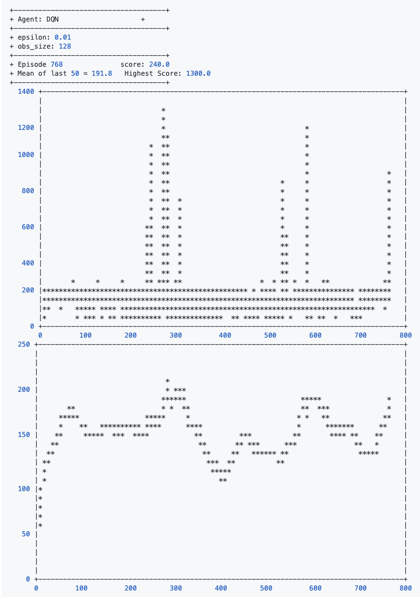

# Frost Bite


## Table des matières

<ol>
    <li><a href="#contexte">Contexte</a></li>
    <li><a href="#histoire">Description du jeu</a></li>
    <li><a href="#details">Détails techniques supplémentaires</a></li>
    <li>
        <a href="#pre-requis">Pré-requis</a>
        <ol>
            <li><a href="#gpu">GPU</a></li>
            <li><a href="#CUDDN">Nvidia CUDDN</a></li>
        </ol>
    </li>
    <li><a href="#journal">Journal</a></li>
    <li><a href="#conclusion">Conclusion</a></li>
    <li><a href="#annexe">Annexe</a></li>
</ol>

<a id="contexte" />

## 1. Contexte

Dans le cadre du cours <strong>Algorithmes d'appentissage par renforcement</strong> donné dans le programme de spécialisation en intelligence artificielle du Cégep de Sainte-foy à Québec, nous devons essayer de faire un agent qui est capable d'apprendre à jouer
à un des jeux offerts sur [OpenAI - Gym](https://gym.openai.com/envs).

Note supplémentaire, le code source des algorithmes à été fourni par Mr.Mikaël pendant les cours.

<p align="right">
    <a href="#table-matieres">:scroll: Aller à la table des matières</a>
</p>

<a id="jeu" />

## 2. Description du jeu


Un jeu de 1983 cree par Steve Cartwright et publier par Activision pour la console Atari 2600.
Il y avait un semblant de multi-joueur avec la posibilite d'alterner en deux personnages.

Le but du jeu est de marquer le plus de points. 

Le joueur peut accumuler des points de differentes facons.
- Sauter sur un bloc de glaces blancs
- Finir un niveau avec des degres de temperature superieur a 0.
- Attraper un poisson.

Chaque fois que le personnage saute sur une ligne de glace blanche, un bloc est ajouter a l'igloo.
Lorsque l'igloo est completer, le joueur peut rentrer dedans pour mettre fin au niveau.
Lorsque le joueur atteri sur une ligne de glace blanche, celle-ci devient bleue. Lorsque toutes les lignes de glaces sont bleus, elles redeviennent blanche.

La direction des lignes de glaces peut etre changer en cliquant sur un bouton et en sacrifiant un bloc de l'igloo en construction.

Il y a deux types de morceaux de glace.
1. Large
2. Petit
Les niveaux alternent en les gros blocs et les petits blocs.

Un ours polaire commence a apparaitre a partir du niveau 4 et se deplace sur la banquise pour empecher le joueur d'atteindre l'igloo.

Le joueur dispose de 3 vies. 
Lorsqu'il meurt, le joueur recommence au niveau qu'il etait rendu avec le meme score. Lorsqu'il epuise sa derniere vie, la partie est terminee et son score est celui qu'il avait juste avant sa mort.

Plusieurs choses peuvent enlever une vie au joueur.
- Tomber dans l'eau.
- Se faire toucher par un oiseau.
- Se faire toucher par l'ours polaire.

> Source https://en.wikipedia.org/wiki/Frostbite_(video_game)

<p align="right">
    <a href="#table-matieres">:scroll: Aller à la table des matières</a>
</p>

<a id="details" />

## 3. Détails techniques supplémentaires

Quels sont les etats, comment est represente l'environnement.

L'environnement est fourni par OpenAI Gym. Il nous donne accès à 128 bytes qui représente la ram du jeu à chaque instant t.
Pour l'agent, jouer au jeu est en soit une tâche épisodique.
La fonction de récompense nous retourne plusieurs récompenses:
- Sauter sur un block de glace blanc -> 10 points
- Terminer un niveau avec des degres restants -> N * degré restants , 15 deg * ? = 310, 40 deg * ? = 1120
- Manger un poisson -> 200 points


Il y a 18 actions possibles : 
| index        | name          | signification  |
|:-- |:-- |:----- |
| 0 | "NOOP" | Ne rien faire |
| 1 | "FIRE" | Échanger un bloc de l'igloo contre un changement de direction. |
| 2 | "UP" | Faire un saut vers le haut |
| 3 | "RIGHT"  | Marcher vers la droite |
| 4 | "LEFT" | Marcher vers la gauche |
| 5 | "DOWN" | Faire un saut vers le bas |
| 6 | "UPRIGHT" | Faire un saut en haut vers la droite |
| 7 | "UPLEFT" | Faire un saut en haut vers la gauche |
| 8 |"DOWNRIGHT" | Faire un saut en bas vers la droite |
| 9 |"DOWNLEFT" | Faire un saut en bas vers la gauche |
| 10 | "UPFIRE" | Échanger un bloc de l'igloo contre un changement de direction. |
| 11 |"RIGHTFIRE" | Échanger un bloc de l'igloo contre un changement de direction. |
| 12 |"LEFTFIRE" | Échanger un bloc de l'igloo contre un changement de direction. |
| 13 | "DOWNFIRE" | Échanger un bloc de l'igloo contre un changement de direction. |
| 14 | "UPRIGHTFIRE" | Échanger un bloc de l'igloo contre un changement de direction. |
| 15 | "UPLEFTFIRE" | Échanger un bloc de l'igloo contre un changement de direction. |
| 16 | "DOWNRIGHTFIRE" | Échanger un bloc de l'igloo contre un changement de direction. |
| 17 | "DOWNLEFTFIRE" | Échanger un bloc de l'igloo contre un changement de direction. |

(https://github.com/openai/gym/blob/master/gym/envs/atari/atari_env.py#L219) 

Jouer au jeu avec l'agent est un problème stationnaire. C'est-à-dire que les décisions ne dépendent pas du temps mais bien de l'état. L'agent vise à apprendre et améliorer une politique qui prendra les mêmes décisions lorsqu'elle sera présenté le même état. Dans note l'état est représenté par l'ensemble des 128 bytes.

La tâche est épisodique mais une chose intéressante qui potentiellement va amener son lot de défis c'est qu'un épisode ne correspond pas à une vie. L'agent commence un nouvel épisode avec 4 vies et lorsqu'il meurt pour la 4ème fois, l'épisode prend fin et son score est totaliser.

Pour comprendre rapidement un peu les interactions possibles entre l'agent et les endroits sur lesquels il peut être dans le jeu. Voici un petit graphique qui inclut la plupart des règles du jeu.


<p align="right">
    <a href="#table-matieres">:scroll: Aller à la table des matières</a>
</p>

<a id="pre-requis" />

## 4. Pré-requis

<a id="gpu" />

### GPU

Si vous n'avez pas de GPU comme moi, vous pouvez en louer un dans le cloud et le configurer en utilisant un autre guide que j'ai fait en me basant sur d'autres guides trouvés sur internet. 

[Mon Guide](https://github.com/Maesimt/tensorflow-cloud-gpu)

### Open AI Gym

Évidamment il faut que Python soit installé pour rouler le code. Il faut aussi avoir les librairies de OpenAI Gym sur sont poste.

[documentation OpenAI Gym](https://gym.openai.com/docs/)

### Graphique Terminal

On peut prendre jupyter, mais j'aime bien rester dans le terminal.

J'ai utiliser termplotlib pour afficher des graphiques comme matplotlib, mais directement dans la console lorsque je suis connecter sur le serveur.

[Github - termplotlib](https://github.com/nschloe/termplotlib)

##  Journal

Essayer une première fois plusieurs des algorithmes vue en cours pour voir si certains sont déjà capable de produire des résultats sans modification quelqueconque.

### a. Sarsa

On vient de voir `Sarsa`, je viens de créer un répertoire avec les `Agents` et les `Experiement` pour centraliser tout le contenu.J'ai brancher `termoplotlib` pour suivre les algos dans le terminal.

J'essaye `Sarsa` avec les paramètres de bases sans rien toucher.


### Reinforce


### DQN


Suite a un crash de la machine sur GCP je n'ai pas pu garder une trace du dernier graphique. La derniere fois que j'avais regarder le graphique on voyait le modele qui avait reussi a faire plusieurs parties superieure a 1400 points.

Cependant l'enregistrement des poids du model en `fichier.h5` etait activer alors j'ai pu conserver l'entrainement qu'il avait realiser jusqu'a un certain point problablement proche du crash.

J'ai ajuster le code pour repartir des poids sauvegardes. Seul difference, j'ai enlever l'exploration et la decroissance pour qu'il reparte de ses acquis. Donc epsilon a 0.01 en partant.

On voit que des les premiers episodes il est capable de refaire une partie superieure a 1400 points, ce qui est encourageant.


Il reussi a avoir deux autres runs interessantes dans un intervalle de 100 parties. Je m'interesse au run superieur a 300 car en-bas de 300 le bot est encore dans le meme niveau du jeu.


Je vais arreter d'enregistrer le modele a chaque episode pour accelerer le temps d'entraintement, tant pis si des crashs comme la derniere fois arrive, je repartirai un peu en arriere.

```python
# DQN - Replay Method
# ...
if self.episodes_not_saved == 100:
    self.model_network.save_weights("weights2.h5")
    self.episodes_not_saved = 0
    
self.episodes_not_saved += 1
```

Je vais ajouter un 2eme graph pour suivre la tendance de la moyenne pour voir quand est-ce qu'on atteint des minimums locaux pour mieux comprendre et suivre l'apprentissage.




### Actor Critic


Changement du nombre de neuronnes par couche.


Je viens de realiser que le DQN a beacoup plus d'hyper-parametres de disponibles que je le croyais.
J'ai ajouter les hyper-parametres que je n'avais pas vue dans l'agent DQN pour les voir.

```python
    def printParameters(self):
        print('+ epsilon: ' + str(self.epsilon))
        print('+ obs_size: ' + str(self.obs_size))
        print('+ gamma: ' + str(self.gamma))
        print('+ batch_size: ' + str(self.batch_size))
        print('+ epoch_length: ' + str(self.epoch_length))
        print('+ learning_rate: ' + str(self.lr))
        print('+ tau: ' + str(self.tau))
        print('+ nHidden: ' + str(self.nhidden))
```

Ma strategie va consister de regarder le DQN qui a marcher pour essayer de prendre des parametres similaires avec ActorCritic.

Dans DQN avec lequel on avait des parties superieur a 1400 de temps en temps, on avait :

```C
+ epsilon: 1
+ obs_size: 128
+ gamma: 0.99
+ batch_size: 64
+ epoch_length: 100
+ learning_rate: 0.0001
+ tau: 0.05
+ nHidden: 150
```

## DQN

Passer de 150 a 64 neuronnes par couches


Bon on va essayer avec une architecture 256 neuronnes, nombre arbitraire qui est le double du nombre de bytes de la ram. (128 x 2). On va le demarrer du debut sans l'arreter.


On voit une bonne progression au debut mais il stagne au [180,220] points.
J'ai de la misere a comprendre pourquoi il ne reussi pas tjrs a passer au 2eme niveau du jeu.
On voit qu'il reussi de temps en temps mais il est quand souvent pris a la fin du premier niveau.

Je vais transferer le fichier du modele et le rouler en local pour voir ce qu'il fait.

# gif.

Je crois qu'il exploite la meilleur strategie qu'il a trouver jusqu'a maintenant. Il semble toujours faire la meme ligne droite avec un retour.
Il voit l'igloo completer mais il ne semble pas realiser le potentiel de point qui se trouve a sa porte et il decide de rexploiter sa ligne de point avec les plateformes de glaces plutot.
Je crois qu'il devrait davantage explorer car il n'a clairement pas encore compris le concept de l'igloo.
Je vais essayer de le faire explorer encore plus longtemps. 
Pour lui faire comprendre le concept de l'igloo tant que ca moyenne de points ne sera pas superieur au premier niveau (800-900 points) plutot que de laisser exploiter a 99.995 je vais lui forcer un 20% d'exploration.

Je viens de repartir une run par accident avec l'ancien weights.h5 et un epislon de 1 alors il va explorer encore comme il l'etait avant.


Meme probleme qu'avant.

On va changer un autre parametre. Si ce n'est pas l'exploration qui regle tout a fait le probleme de ressayer les meme solutions. Peut-etre que c'est de l'overfitting sur les experiences du passer qui ont donner des resultats positifs. Je vais tester une reduction du epoch length pour voir si ca diminue l'overfitting et ca nous permet de rejoindre l'igloo plus facilement.

Jusqu'ici je crois que je suis pris dans un maximum local, a cause du potentiel inexplorer de l'igloo.


Conclusion on dirait pas que ca nuit, mais c'est moins bon un peu. Note a moi meme l'exploitation n'etait pas a fond j'avais laisser le 20% d'exploration.
Le epoch length a 100 etait mieux.

On va essayer le learning rate.


Bon bah ca diverge.

On va jouer sur le gamma pour le mettre encore plus proche de 1 pour encourager les recompenses dans le future en esperant que l'agent considere l'igloo.


Trop fort l'apprentissage est penaliser. On va ressayer un peu moins fort.


Bon bah c'etait pas vraiment mieux.
Je vais essayer avec un gamma plus petit de ce qu'on avait au debut.


La, c'est bien, une moyenne a 550. Seul probleme c'est que j'enregistre au 100 episodes de facons fixe. Je vais changer le moment de l'enregistrement.

Mettre le gif du bonhomme dans le coin. ICI .gif

```Python
if self.average_score > self.best_average:
    self.model_network.save_weights("weights.h5")
```

Next try, 
- diminuer le gamma 0.9 -> 0.85
- le decay d'epsilone 0.9995 -> 0.9999 (faire de l'exploration plus longtemps.)


Bon bah c'etait boring ca. Pas reussir a passer dans le niveau 2. Juste vraiment bon sur le niveau 1.


Meme avec les anciens parametres je n'arrive pas a reproduire une moyenne de 550. Le hasard joue quand meme un bon role sur la decouverte du monde.

On va jouer sur le Tau voir qu'est-ce que ca fait.
0.05 -> 0.1


C'est mieux.

Essayer d'enlever les 8 actions de fire puisque ca ne sert a rien dans ce jeu pour eviter de perdre du temps avec des controles inutilises.

```Python
# env.action_space == Discrete(18)
gym.spaces.Discrete(10)
```


# Conclusion

Demontration (.gif)

presentation des performances.
