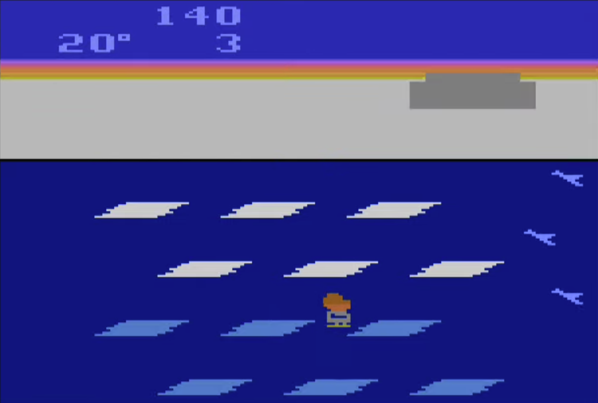
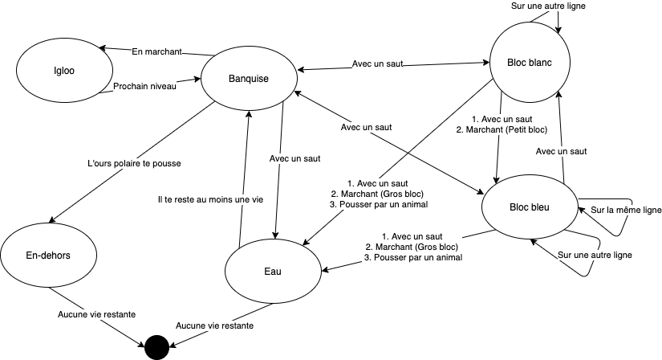
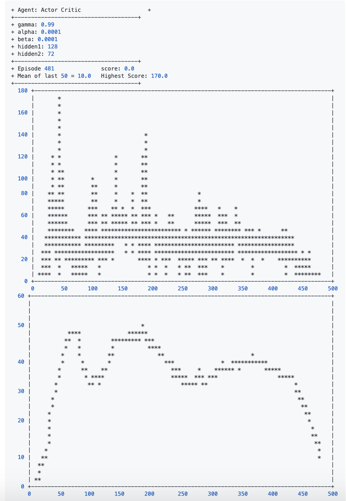

# Frostbite - Apprentissage par renforcement


<a id="table-matieres" />

## Table des matières

<ol>
    <li><a href="#contexte">Contexte</a></li>
    <li><a href="#jeu">Description du jeu</a></li>
    <li><a href="#details">Détails techniques supplémentaires</a></li>
    <li>
        <a href="#pre-requis">Pré-requis</a>
        <ol>
            <li><a href="#gpu">GPU</a></li>
            <li><a href="#openai">OpenAI Gym</a></li>
            <li><a href="#termplotlib">Termplotlib</a></li>
        </ol>
    </li>
    <li>
        <a href="#journal">Journal</a>
        <ol>
            <li><a href="#sarsa">Sarsa</a></li>
            <li><a href="#reinforce">Reinforce</a></li>
            <li><a href="#dqn-1">DQN</a></li>
            <li><a href="#actor-critic">Actor-Critic</a></li>
            <li><a href="#dqn-2">Le retour de DQN</a></li>
            <li><a href="#autre-idee">Autre idée</a></li>
        </ol>
    </li>
    <li><a href="#conclusion">Conclusion</a></li>
</ol>

<a id="contexte" />

## 1. Contexte

Dans le cadre du cours <strong>Algorithmes d'appentissage par renforcement</strong> donné dans le programme de spécialisation en intelligence artificielle du Cégep de Sainte-foy à Québec, nous devons essayer de faire un agent qui est capable d'apprendre à jouer
à un des jeux disponibles sur [OpenAI - Gym](https://gym.openai.com/envs).

Note supplémentaire, le code source des algorithmes à été fourni par Mr.Mikaël pendant les cours.

<p align="right">
    <a href="#table-matieres">:scroll: Aller à la table des matières</a>
</p>

<a id="jeu" />

## 2. Description du jeu

Un jeu de 1983 cree par Steve Cartwright et publier par Activision pour la console Atari 2600.
Il y avait un semblant de multi-joueur avec la posibilite d'alterner en deux personnages.

Le but du jeu est de marquer le plus de points. 

#### Le joueur peut accumuler des points de trois facons

| Façon de gagner des points | Démonstration  |
|:-- | :----- |
| Sauter sur un bloc de glaces blancs |  |
| Finir un niveau avec des degres de temperature superieur a 0. |  |
| Attraper un poisson. |  |

Chaque fois que le personnage saute sur une ligne de glace blanche, un bloc est ajouter a l'igloo.
Lorsque l'igloo est completer, le joueur peut rentrer dedans pour mettre fin au niveau.
Lorsque le joueur atteri sur une ligne de glace blanche, celle-ci devient bleue. Lorsque toutes les lignes de glaces sont bleus, elles redeviennent blanche.

La direction des lignes de glaces peut etre changer en cliquant sur un bouton et en sacrifiant un bloc de l'igloo en construction.

Il y a deux types de morceaux de glace.
1. Large
2. Petit

Les niveaux alternent en les gros blocs et les petits blocs.

| Niveau 1 | Niveau 2 |
|:-- | :----- |
|  |  |

Notes:
- Les deplacements horizontaux sont mortels au niveau 1 mais permis entre les blocs du niveau 2.

Un ours polaire commence a apparaitre a partir du niveau 4 et se deplace sur la banquise pour empecher le joueur d'atteindre l'igloo. Le joueur dispose de 3 vies. Lorsqu'il meurt, le joueur recommence au niveau qu'il etait rendu avec le meme score. Lorsqu'il epuise sa derniere vie, la partie est terminee et son score est celui qu'il avait juste avant sa mort.

#### Plusieurs choses peuvent enlever une vie au joueur.

| Façon de mourir | Démonstration  |
|:-- | :----- |
| Tomber dans l'eau. |  |
| Se faire toucher par l'ours polaire. |  |
| La température atteint le 0 degré |  |

> Source https://en.wikipedia.org/wiki/Frostbite_(video_game)

<p align="right">
    <a href="#table-matieres">:scroll: Aller à la table des matières</a>
</p>

<a id="details" />

## 3. Détails techniques supplémentaires

L'environnement est fourni par OpenAI Gym. Il nous donne accès à 128 bytes qui représente la ram du jeu à chaque instant t.
Pour l'agent, jouer au jeu est en soit une tâche épisodique.

La fonction de récompenses nous retourne des points lorsqu'on :
1. Saute sur un block de glace blanc (10 points * K) 
2. Termine un niveau avec des degres restants (1 point par degré restant * K) 
3. Mange un poisson (200 points) 

> où K = Un nombre qui augmente avec le temps et la progression du jeu.

Il y a 18 actions possibles dans l'environnement d'OpenAI. Ils correspondent aux touches de la manette de la console Atari 2600.
| index        | name          | signification  |
|:-- |:-- |:----- |
| 0 | "NOOP" | Ne rien faire |
| 1 | "FIRE" | Échanger un bloc de l'igloo contre un changement de direction. |
| 2 | "UP" | Faire un saut vers le haut |
| 3 | "RIGHT"  | Marcher vers la droite |
| 4 | "LEFT" | Marcher vers la gauche |
| 5 | "DOWN" | Faire un saut vers le bas |
| 6 | "UPRIGHT" | Faire un saut en haut vers la droite |
| 7 | "UPLEFT" | Faire un saut en haut vers la gauche |
| 8 |"DOWNRIGHT" | Faire un saut en bas vers la droite |
| 9 |"DOWNLEFT" | Faire un saut en bas vers la gauche |
| 10 | "UPFIRE" | Échanger un bloc de l'igloo contre un changement de direction. |
| 11 |"RIGHTFIRE" | Échanger un bloc de l'igloo contre un changement de direction. |
| 12 |"LEFTFIRE" | Échanger un bloc de l'igloo contre un changement de direction. |
| 13 | "DOWNFIRE" | Échanger un bloc de l'igloo contre un changement de direction. |
| 14 | "UPRIGHTFIRE" | Échanger un bloc de l'igloo contre un changement de direction. |
| 15 | "UPLEFTFIRE" | Échanger un bloc de l'igloo contre un changement de direction. |
| 16 | "DOWNRIGHTFIRE" | Échanger un bloc de l'igloo contre un changement de direction. |
| 17 | "DOWNLEFTFIRE" | Échanger un bloc de l'igloo contre un changement de direction. |

(https://github.com/openai/gym/blob/master/gym/envs/atari/atari_env.py#L219) 

Jouer au jeu avec l'agent est un problème stationnaire. C'est-à-dire que les décisions ne dépendent pas du temps mais bien de l'état. L'agent vise à apprendre et améliorer une politique qui prendra les mêmes décisions lorsqu'elle sera présenté le même état. Dans note l'état est représenté par l'ensemble des 128 bytes.

La tâche est épisodique mais une chose intéressante qui potentiellement va amener son lot de défis c'est qu'un épisode ne correspond pas à une vie. L'agent commence un nouvel épisode avec 4 vies et lorsqu'il meurt pour la 4ème fois, l'épisode prend fin et son score est totaliser.

Pour comprendre rapidement un peu les interactions possibles entre l'agent et les endroits sur lesquels il peut être dans le jeu. Voici un petit graphique qui inclut la plupart des règles du jeu.



Notre objectif c'est en quelque sorte de créer un agent qui est capable d'apprendre à naviguer au travers de ce graphique en évitant les points de terminaison. Avec plusieurs épisodes (parties), il va apprendre à éviter les situations terminales et exploiter certains mouvements pour accumuler des points. Une phase d'exploration sera de mise car il ne connait pas les règles de transitions décrites par ce graphique. Il devra aussi les apprendres au fur et à mesure.

<p align="right">
    <a href="#table-matieres">:scroll: Aller à la table des matières</a>
</p>

<a id="pre-requis" />

## 4. Pré-requis

<a id="gpu" />

### GPU

Si vous n'avez pas de GPU comme moi, vous pouvez en louer un dans le cloud et le configurer en utilisant un autre guide que j'ai fait en me basant sur des articles trouvés sur internet. 

[Mon Guide](https://github.com/Maesimt/tensorflow-cloud-gpu)

<p align="right">
    <a href="#table-matieres">:scroll: Aller à la table des matières</a>
</p>

<a id="openai" />

### OpenAI Gym

Évidamment il faut que Python soit installé pour rouler le code. Il faut aussi avoir les librairies de OpenAI Gym sur sont poste.

[Documentation OpenAI Gym](https://gym.openai.com/docs/)

<p align="right">
    <a href="#table-matieres">:scroll: Aller à la table des matières</a>
</p>

<a id="termplotlib" />

### Graphique Terminal

On peut prendre jupyter notebook, mais j'aime bien rester dans le terminal. Une interface graphique n'est pas obligatoire. On peut toujours transférer les modèles entrainés sur notre machine locale plus tard pour voir le rendu.

J'ai utiliser termplotlib pour afficher des graphiques comme matplotlib, mais directement dans la console lorsque je suis connecter sur le serveur. Ça permet de suivre l'entrainement de l'algorithme en temps réel. Pour éviter les problèmes liés aux coupures d'internet, je recommande de démarrer des terminaux virtuels sur le server avec [Tmux](https://github.com/tmux/tmux/wiki/Getting-Started)

[Github - termplotlib](https://github.com/nschloe/termplotlib)

<p align="right">
    <a href="#table-matieres">:scroll: Aller à la table des matières</a>
</p>

<a id="journal" />

##  Journal

Ma stratégie initiale, c'est d'essayer une première fois plusieurs des algorithmes vues en cours pour voir si certains sont déjà capable de produire des résultats sans modification.

<p align="right">
    <a href="#table-matieres">:scroll: Aller à la table des matières</a>
</p>

<a id="sarsa" />

### Sarsa

On vient de voir `Sarsa`, je viens de créer un répertoire avec les `Agents` et les `Experiment` pour centraliser tout le contenu.J'ai brancher `termplotlib` pour suivre les algos dans le terminal avec `tmux`.

J'essaye `Sarsa` avec les paramètres de bases sans rien toucher.


Pas super bon, après 1000 parties on dirait que l'agent fait n'importe quoi. 

Je sais pas trop quoi faire, je vais augmenter l'epsilon et baisser l'alpha:
```haskell
epsilon: 0.2 -> 0.4
  alpha: 0.5 -> 0.1
```


Légère amélioration par rapport à avant. L'agent fait encore n'importe quoi. Le nombre de partie n'est peut-être pas suffisant.
J'ai essayer avec plusieurs autres paramètres avant de prendre des notes de qualités et j'ai essayer avec du gros volume d'épisodes (>30 000), mais sans succès. Ça restait pas mal aléatoire, mais on peut dire qu'un des avantages de Sarsa c'est la vitesse à laquelle il roule comparer aux algorithmes.

<p align="right">
    <a href="#table-matieres">:scroll: Aller à la table des matières</a>
</p>

<a id="reinforce" />

### b. Reinforce

J'ai ajouter `Reinforce` dans le projet. Je vais essayer avec les paramètres par défaut du cours.


Pour 1000 parties c'est encore pire que `Sarsa`.

Je ne sais pas trop vers où m'enligner. Je vais jouer avec le nombre de neuronnes par couches voir qu'est-ce que ca peut faire. Et ajouter une 3ème couche cachée pour voir.  Je pense que mon problème doit être plus complexe que le `Cart Pole` et le `Lunar Lander`. 

```haskell
         1ère couche: 36 -> 128
         2ème couche: 36 -> 128
Nouvelle 3ème couche: 128
```

* Le nombre 128 parce que c'est le nombre de bytes qui représente l'état. Je me dis que peut-ètre que c'est bien d'avoir 1 neuronnes fully-connected à chaque bytes de l'état (via la couche d'entrée). C'est complètement aléatoire, j'ai aucune idée si c'est une bonne décision.
** Une nouvelle couche parce que le problème est plus complexe que ceux vu dans le cours. Encore là, aucune idée si c'est une bonne décision.
*** Au moins je respecte le design de couche identique, peut-être que c'est pas fou, à voir.


C'est un peu mieux qu'avant, c'est comparable à `Sarsa` encore avec 1000 épisodes.

Avec la même logique un peu douteuse que j'ai prise avant, peut-être que je si réduis le nombres de neuronnes de la dernière couche cachée au même nombre que la couche de sortie. 18 c'est le nombre d'actions disponibles dans l'émulateur.

J'ai aussi enlever la limite de 1000 épisodes (parties) pour voir si avec le temps ça devient mieux.


Bon on voit que les résultats semblent plus haut. La moyenne des 50 dernieres parties est pire, mais on voit qu'il était meilleur dans l'ensemble même au tout début. C'est peut-être faux parce qu'on voit que l'amplitude est similaire mais l'échelle des X n'est pas la même ça se peut que la compression dans le graphique nous induise en erreur.

<p align="right">
    <a href="#table-matieres">:scroll: Aller à la table des matières</a>
</p>

<a id="dqn-1" />

### DQN

Nouvelle agent à essayer, comme d'habitude, les paramètres par défaut du cours. Je vais le laisser tourner un peu plus longtemps comme la dernière "run" de `Reinforce`.


On voit que c'est carrément meilleur que les autres dès le début.


Notes:

+ L'image ci-dessus c'est la suite de l'entrainement de la première run.
+ Il manque le paramètre de décroissance du Epsilon parce que je l'avais modifier directement dans l'algo.
+ Epsilon bouge pas rapport à la première image parce qu'il décroit pendant l'entrainement.


On voit qu'il vient d'avoir un score de 1470. Le meilleur jusqu'à présent.
Je vais laisser l'entrainement continuer pour voir s'il va réussir à faire d'autres gros scores.

> Pretend like there's a picture here :(

Suite a un crash de la machine sur GCP, je n'ai pas pu garder une trace du dernier graphique. La derniere fois que j'avais regarder le graphique, on voyait l'agent qui avait réussi à faire plusieurs parties supérieure a 1400 points.

Heureusement, l'enregistrement des poids du model en `fichier.h5` était activé alors j'ai pu conserver l'entrainement qu'il avait realiser jusqu'à un certain point problablement proche du crash.

J'ai ajouter du code pour repartir des poids sauvegardés.

```python
# Load existing model if available.
existingWeightsFile = "weights.h5";
if (path.exists(existingWeightsFile)):
    print('Loaded existing weights from ', existingWeightsFile)
    self.model_network.load_weights("weights.h5")
```

Seul difference, j'ai enlever l'exploration et la décroissance pour qu'il reparte de ses acquis. Donc epsilon a 0.01 en partant.


On voit que des les premiers episodes il est capable de refaire une partie superieure a 1400 points, ce qui est encourageant.

Ça prouve aussi que le chargement des poids enregistrés à bien fonctionner.

Je le laisse aller pour comprendre un peu mieux où il était rendu avant le crash de la machine sur GCP.


Il reussi a avoir deux autres runs interessantes dans un intervalle de 100 parties. Je m'interesse au run superieur a 300 car en-bas de 300 le bot est encore dans le meme niveau du jeu.

J'arrète l'agent pour faire un petite modification au code, suite à des commentaires des autres étudiants sur Teams.

Je change le code pour qu'il enregistre les poids après 100 épisodes pour accelerer le temps d'entraintement, tant pis si des crashs comme la derniere fois arrive, je repartirai un peu en arriere.

```python
# DQN - Replay Method
# ...
if self.episodes_not_saved == 100:
    self.model_network.save_weights("weights2.h5")
    self.episodes_not_saved = 0
    
self.episodes_not_saved += 1
```

Aussi, je vais ajouter un 2eme graphique pour suivre la tendance de la moyenne pour voir quand est-ce qu'on atteint des minimums locaux pour mieux comprendre et suivre l'apprentissage.

Je relance le même agent `DQN` déjà entrainé avec ces deux changements.


La performance de l'agent a plateau, mais de temps en il a des bonnes "runs".

<p align="right">
    <a href="#table-matieres">:scroll: Aller à la table des matières</a>
</p>

<a id="actor-critic" />

### Actor Critic

Dernier cours, un nouvel agent à essayer. Même chose ont relance avec les paramètres par défaut.


Eh, c'est vraiment étrange comme graphique, il plateau instantannément au début, ensuite il doit explorer pour finalement revenir exactement où il était plutôt.


Prochaine "run", changement du nombre de neuronnes par couche:

```haskell
couche cachée 1: 32 -> 128
couche cachée 2: 32 -> 72
```

Encore une fois le nombre de neuronnes est choisi avec très peu réflexion.



Oups, c'est atroce. Ça commence bas, ça monte à peine et ça se casse la geule en pas trop de temps.
Je vais retourner sur `DQN`.

<p align="right">
    <a href="#table-matieres">:scroll: Aller à la table des matières</a>
</p>

<a id="dqn-2" />

## Le retour de DQN

Je viens de realiser que le DQN a beacoup plus d'hyper-parametres de disponibles que je le croyais.
J'ai ajouter les hyper-paramètres que je n'avais pas vue dans l'agent DQN pour les voir dans la console.

```python
def printParameters(self):
    print('+ epsilon: ' + str(self.epsilon))
    print('+ obs_size: ' + str(self.obs_size))
    print('+ gamma: ' + str(self.gamma))
    print('+ batch_size: ' + str(self.batch_size))
    print('+ epoch_length: ' + str(self.epoch_length))
    print('+ learning_rate: ' + str(self.lr))
    print('+ tau: ' + str(self.tau))
    print('+ nHidden: ' + str(self.nhidden))
```

Dans l'agent DQN avec lequel on avait des parties superieur a 1400 de temps en temps, on avait les paramètres par défaut soit :

```haskell
      epsilon: 1
     obs_size: 128
        gamma: 0.99
   batch_size: 64
 epoch_length: 100
learning_rate: 0.0001
          tau: 0.05
      nHidden: 150
```
Je vais essayer de nouvelles choses en jouant avec des paramètres.
En commençant par diminuer le nombre de neuronnes par couches.

```haskell
nHidden: 150 -> 64
```


Ah bah, c'est pas super ça meurt dès le début, la quantité de neuronnes ne doit pas ètre suffisantes pour s'ajuster à la compléxité de l'environnement.

On va essayer avec une architecture 256 neuronnes, nombre arbitraire qui est le double du nombre de bytes de la ram. (128 x 2).


L'agent plateau à 180 points après environ 2000 épisodes.

On voit une bonne progression au debut mais il stagne au [180,220] points.
J'ai de la misere a comprendre pourquoi il ne reussi pas tjrs a passer au 2eme niveau du jeu.
On voit qu'il reussi de temps en temps mais il est quand souvent pris a la fin du premier niveau.

Je vais transférer le fichier du modèle et le rouler en local pour voir ce qu'il fait.


Je crois qu'il exploite la meilleur strategie qu'il a trouver jusqu'à maintenant. Il semble toujours faire la même ligne droite avec un retour.
Il voit l'igloo compléter mais il ne semble pas réaliser le potentiel de points qui se trouve à sa porte et il decide de réexploiter sa ligne de point avec les plateformes de glaces plutôt que d'aller dans l'igloo. Je crois qu'il devrait davantage explorer car il n'a clairement pas encore compris le concept de l'igloo.
Je vais essayer de le faire explorer encore plus longtemps. Pour lui faire comprendre le concept de l'igloo tant que ca moyenne de points ne sera pas supérieur au premier niveau (800-900 points) plutôt que de laisser exploiter à 99% je vais lui forcer un 20% d'exploration.

Je viens de repartir une run par accident avec l'ancien `weights.h5` et un `epsilon` de 1 alors il va explorer à 100% et diminuer avec le `epsilon decay` comme lors d'une nouvelle "run".


Même probleme qu'avant.

On va changer un autre parametre. Si ce n'est pas l'exploration qui règle tout à fait le problème, il y a surement un paramètre qui peut nous aider. Peut-être que c'est de l'overfitting sur les expériences du passé qui nous ont donner des résultats positifs. Je vais tester une réduction du `epoch length` pour voir si ça diminue l'overfitting et ca nous permet de rejoindre l'igloo plus facilement.

Jusqu'ici je crois que je suis pris dans un maximum local, à cause du potentiel inexploré de l'igloo.


Conclusion on dirait pas que ca nuit, mais c'est un peu moins bon. 
> Note à moi même l'exploitation n'était pas a fond j'avais laisser le 20% d'exploration.

Le `epoch length` à 100 était mieux.

On va essayer le `learning rate`.


Bon bah, ça diverge.

On va jouer sur le `gamma` pour le mettre encore plus proche de 1 pour encourager les récompenses dans le future en espérant que l'agent considère ensuite l'igloo.


Trop fort l'apprentissage est pénalisé. On va réssayer un peu moins fort.


Bon bah, c'était pas vraiment mieux.
Je vais essayer avec un gamma plus petit que ce que l'on avait au début.


Là, c'est bien, une moyenne à 550 points. Seul probleme c'est que j'enregistre au 100 épisodes de facons fixe. Je vais changer le moment de l'enregistrement.

```Python
if self.average_score > self.best_average:
    self.model_network.save_weights("weights.h5")
```

Next try, on change encore 2-3 trucs.
```haskell
        gamma: 0.9    -> 0.85
epsilon decay: 0.9995 -> 0.9999 (faire de l'exploration plus longtemps.)
```


Bon bah c'était boring ça. Pas réussir à passer dans le niveau 2. Juste vraiment bon sur le niveau 1.


Même avec les anciens paramètres, je n'arrive pas à reproduire une moyenne de 550 points. Le hasard joue quand même un bon role sur la découverte du monde.

On va jouer sur le `tau` voir qu'est-ce que ca fait.

```haskell
tau: 0.05 -> 0.1
```


C'est mieux.

Je viens de réaliser que les 8 actions de `fire` avec une direction ne servent à rien dans ce jeu. La commande `fire` ne fait que changer la direction de la ligne de glace sur laquelle on est et la direction du "joystick" ne change rien. Pour eviter de perdre du temps avec des controles inutilises je vais les enlever.

```Python
# Avant j'utilisais env.action_space
gym.spaces.Discrete(10)
```


Wow, c'est le plus rapide à atteindre le plateau avec à peine 500 épisodes. Les premiers entrainements de DQN pouvaient prendre jusqu'à 2000-2500 épisodes pour atteinre le plateau de 180 points.

Je vais le laisser continuer voir s'il réussi à devenir bon dans le 2ème niveau.

```C
+-------------------------------------+
+ Agent: DQN                    +
+-------------------------------------+
+ epsilon: 0.01236855095771794
+ obs_size: 128
+ gamma: 0.9
+ batch_size: 64
+ epoch_length: 100
+ learning_rate: 0.0001
+ tau: 0.1
+ nHidden: 256
+-------------------------------------+
+ Episode 1562              score: 80.0
+ Mean of last 50 = 169.6   Highest Score: 1750.0
+-------------------------------------+
  1800 +----------------------------------------------------------------------------------------+
       |                                         *                                              |
       |                                         *                                              |
  1600 |                                         *                                              |
       |                                         *                                              |
       |                                         *  *                      *                    |
  1400 |                                         *  *                      *                    |
       |                                         *  *   *                  *                    |
       |                                         *  *   *                  *                    |
  1200 |                                         *  *   *       *          *                    |
       |                                         *  *   *       *          *                    |
       |                                         *  *   *       *         **           *        |
  1000 |                                         *  *   *       *         **           *        |
       |                                         *  *   *       *         **  *    *   *        |
   800 |                                         *  *   *       *         **  *    *   *   *    |
       |                                         *  *   *       *         **  *    *   *   *    |
       |                                         *  *   *       *         **  *    *   *   *    |
   600 |                                         *  *   *       *         **  *    *   *   *    |
       |                                         *  *   *       *         **  *    *   *   *    |
       |                                         *  *   *       *         **  *    *   *   *    |
   400 |                                         *  *   *       *         **  *    *   *   *    |
       |                                         *  *   *       *         **  *    *   *   *    |
       |                               *    * *  * **   ** *  * * *    *****  *   *** *** ** *  |
   200 |      *  *  *************************************************************************** |
       |*************************************************************************************** |
       |*************************** ************ **** ** ** *  ***   ********** *******  ****** |
     0 +----------------------------------------------------------------------------------------+
       0         200        400        600         800        1000       1200       1400       1600
  250 +-----------------------------------------------------------------------------------------+
      |                                             *                                           |
      |                                            **                                           |
      |                                            **                      *                    |
      |                                          ****                      **                   |
  200 |                                          **********     * *        ****        ***      |
      |                                          *    **  *  ***** **    ********   ** *** ***  |
      |                                         **    **  ******** ********   * * **** * *****  |
      |                             ******* *  ***    **  ***        **          **  **   *  ** |
      |                          **** **********                                 **  *        * |
  150 |                        **** *        *                                                  |
      |                     *****                                                               |
      |                    *****                                                                |
      |              *******                                                                    |
      |             *******                                                                     |
      |            **                                                                           |
  100 |        *****                                                                            |
      |       *****                                                                             |
      |      **                                                                                 |
      |********                                                                                 |
      |** *                                                                                     |
   50 |*                                                                                        |
      |                                                                                         |
      |                                                                                         |
      |                                                                                         |
      |                                                                                         |
    0 +-----------------------------------------------------------------------------------------+
      0         200         400        600        800        1000        1200       1400       1600
```

<p align="right">
    <a href="#table-matieres">:scroll: Aller à la table des matières</a>
</p>

<a id="autre-idee" />

### Autre idée

N-epsilon, terme que je viens d'inventer (copyright - joke). On sait que les tableaux du jeu alterne entre des petits blocs et des gros blocs. Ça change beaucoup le comportement du jeu. Si on avait un algorithme qui devait apprendre à faire cuire des carottes au premier niveau et apprendre à faire cuire des croissants au 2ème niveau. Si l'exploration est rendu nulle en arrivant au niveau 2, il n'aura pas eu le temps d'explorer la complexité de la cuisson des croissants. Il va simplement appliquer sa politique de cuisson des carottes et les croissants vont être râtés.

je vais utiliser un `epsilon` pour le premier niveau et un autre `epsilon` pour le deuxième niveau.
Comme ca lorsque la politque de l'agent devient greedy (1% exploration) sur le premier niveau et qu'il le maitrise, il va aller directement au deuxième niveau. Son score sera supérieur à 400 (dans Frosbite), il va utiliser l'autre `epsilon` pour le 2ème niveau et donc recommencer avec un 100% d'exploration. On perd en généralisation de l'algorithme mais on lui donne une information supplémentaire sur le fonctionnement du jeu.

> C'est en quelque sorte ce qu'on a vu dans le cours, on peut donner un modele du monde à un agent pour l'aider. Je sais que le 2ème niveau à des nouveautés comme les poissons et que la logique de déplacement sur la glace n'est pas la même. Dans le niveau 1 les mouvements horizontaux sont mortels alors que dans le deuxième niveau c'est tout à fait possible et permettre d'aller chercher les poissons plus rapidement.

On va choisir l'epsilon d'un niveau si le score est <= 400 et l'epsilon du niveau 2 si le score est > 400 tel que :
```python
current_epsilon = self.epsilon if self.score <= 400 else self.epsilon_lvl_2 
if np.random.random() < current_epsilon:
    i = np.random.randint(0,len(np.arange(self.actions.n)))
else: 
    i = np.argmax(self.model_network.predict(state.reshape(1, state.shape[0]))[0])  
```

Et avec la même logique on va decay l'epsilon approprié:

```python
if self.epsilon_decay:
    if self.step_counter % self.epoch_length == 0:
        if self.score > 400:
            self.epsilon_lvl_2 = max(.01, self.epsilon_lvl_2 * .9995)
        else:
            self.epsilon = max(.01, self.epsilon * .9995)
```

On lance ca, en espérant que ça réussise à briser le plateau.

```C
+-------------------------------------+
+ Agent: DQN                    +
+-------------------------------------+
+ epsilon: 0.01
+ epsilon lvl 2: 0.9333105749632893
+ obs_size: 128
+ gamma: 0.9
+ batch_size: 64
+ epoch_length: 100
+ learning_rate: 0.0001
+ tau: 0.1
+ nHidden: 256
+-------------------------------------+
+ Episode 3849              score: 160.0
+ Mean of last 50 = 186.8   Highest Score: 2000.0
+-------------------------------------+
  2000 +----------------------------------------------------------------------------------------+
       |                                         *                                              |
       |                                         *                                              |
       |                           *             *                                              |
       |                       *   *             *                                              |
       |                       *   *             *                                              |
  1500 |                       *   *             *                                              |
       |                       *   *             *              *                               |
       |                       *   *             *              *                               |
       |                       *   *        *    *              *                               |
       |                *      *   *  *     *    *              *                 *             |
       |                *      *   *  *     * ** *              *                 *             |
       |                * *    *   *  *     * ** *              *                 *             |
  1000 |                * * *  *   *  ***   * ** *              **                *             |
       |                * * *  *   *  ***   * ** *              **        *       *             |
       |                * * * **  **  ***   * ****        *     **        *       *             |
       |                * * * **  *** ***   * ****    *   *     **        * *    **    * *      |
       |                * * * **  *** ***   * ****    *   *     **        * *    **    * *      |
       |                * * * **  *** ***   ******    *   *     **        * *    **    * *      |
   500 |                * * * *** *** ***   ******    *   *     **        * *    **    * *      |
       |                * * * *** *** ***   ******    *   *     **        * *    **    * *      |
       |                * * * *** *** ***   ******    *   *     **        * *    **    * *      |
       |             *  * * * *** *** ***   ******   **  **     **       ** * *  **    * *      |
       |    * ********************************************************************************  |
       |**************************************************************************************  |
       |*************** ************************ ********************************** **********  |
     0 +----------------------------------------------------------------------------------------+
       0         500        1000       1500        2000       2500       3000       3500       4000
  300 +-----------------------------------------------------------------------------------------+
      |                                                                                         |
      |                        *                                                                |
      |                       **                                                                |
      |                       **                                                                |
  250 |                       **                *                                               |
      |                       **                **                                              |
      |                       **   *  ***       **                                *             |
      |                 **    **  **  ***     ****                                *             |
      |                ****   ** **** ****    ****                                **   **       |
  200 |                ***** *** ** * ****    ****                *     *        ****  ****     |
      |               ** ********** **** *  ******              ***    *** ***** * *** ******   |
      |             ****  ****  **  **   * *** ***** *         ***** ********* ***  **** *****  |
      |            **     ***   **  **   *****   ******   **   *** ****  *** *  **    *    **   |
      |            *                 *   ****    ** ******** * *** **    **                     |
      |          ***                       *     *   *************        *                     |
  150 |         ***                                    * **** **                                |
      |       ***                                           * *                                 |
      |       **                                                                                |
      |       *                                                                                 |
      |       *                                                                                 |
  100 |      **                                                                                 |
      |    ***                                                                                  |
      |*  ****                                                                                  |
      |******                                                                                   |
      | **                                                                                      |
   50 +-----------------------------------------------------------------------------------------+
      0         500         1000       1500       2000       2500        3000       3500       4000
```

Il y a pas été assez performant pour être souvent dans le niveau 2.

Dernier espoir du lundi matin on va combiner les parametres au milieu de tout ce qui a marcher pour voir.

```haskell
neuronnes:  150 + 228 / 2 = 203 = 202 (pour avoir un nombre pair)
      tau:          0.5 + 1 / 2 = 0.75
    gamma:       0.99 + 0.9 / 2 = 0.945
```

Go middle ground !

```C
+-------------------------------------+
+ Agent: DQN                    +
+-------------------------------------+
+ epsilon: 0.018892460897838654
+ epsilon lvl 2: 0.993519464294648
+ obs_size: 128
+ gamma: 0.945
+ batch_size: 64
+ epoch_length: 100
+ learning_rate: 0.0001
+ tau: 0.75
+ nHidden: 202
+-------------------------------------+
+ Episode 1484              score: 150.0
+ Mean of last 50 = 168.8   Highest Score: 1000.0
+-------------------------------------+
  1000 +----------------------------------------------------------------------------------------+
       |                                                                           *            |
       |                                                                           *            |
       |                                                                           *            |
       |                                                              *     *      *            |
   800 |                                                              *     *  *   *            |
       |                                                              *     *  *   *            |
       |                                                              *     *  *   *            |
       |                                                              *     *  *   *            |
       |                                                              *     *  *   *            |
   600 |                                                              *     *  *   *            |
       |                                                              *     *  *   *            |
       |                                                              *     *  *   *            |
       |                                                              *     *  *   *            |
       |                                                              *     *  *   *            |
       |                                                              *     *  *   *            |
   400 |                                                              *     *  *   *            |
       |                                                              *     *  *   *            |
       |                                                              *     *  *   *            |
       |                    *                               *      * ** *   * ** * ***          |
       |                    *  *   *  *** *    * * *  ** * ***** ********************** **      |
   200 |            * ********************************************************************      |
       |    * ** ** **********************************************************************      |
       |********************************************************* ************************      |
       |********************************************** ********** * ********* **** * * ***      |
       |*****************************   **  * * * *  *  *  **   *      **      **               |
     0 +----------------------------------------------------------------------------------------+
       0         200        400        600         800        1000       1200       1400       1600
  220 +-----------------------------------------------------------------------------------------+
      |                                                                                         |
      |                                                                       *      **         |
  200 |                                                                       **    ***         |
      |                                                                     *****  *****        |
  180 |                                                               ***  *** *** *   **       |
      |                                                   **       ****** ***   ****    *       |
      |                                                 ********  ** ******      ***    **      |
  160 |                                            *  ***  ********     ***                     |
      |                                   *   **********        **                              |
  140 |                               ****** ** * *  *                                          |
      |                             ****** ****                                                 |
      |                          * ***                                                          |
  120 |                     **  *****                                                           |
      |                  ******** *                                                             |
      |                 **    **                                                                |
  100 |                **                                                                       |
      |                *                                                                        |
   80 |*            ****                                                                        |
      |*         *******                                                                        |
      |******   ***                                                                             |
   60 |  *********                                                                              |
      |                                                                                         |
   40 |                                                                                         |
      |                                                                                         |
      |                                                                                         |
   20 +-----------------------------------------------------------------------------------------+
      0         200         400        600        800        1000        1200       1400       1600
```

Bon, malheureusement je n'ai pas eu le temps d'avoir une run avec une moyenne supérieur à 300 points pour tester ma théorie. J'aurai voir si l'idée était viable pour exploiter le niveau 1 et continuer d'explorer dans le niveau 2 pour éviter les problèmes d'exploitation trop précoce. 

<p align="right">
    <a href="#table-matieres">:scroll: Aller à la table des matières</a>
</p>

<a id="conclusion" />

# Conclusion

J'ai choisi d'y aller avec `DQN` à cause des gains initiaux versus les autres algorithmes. Avec un contexte plus souple en terme de temps et avec une carte graphique à disposition pour éviter les coûts du cloud, j'aurais insister plus sur `Actor-Critic`. J'aurais aussi essayer plus d'algorithmes disponibles sur internet avec d'autres frameworks que Tensorflow.

Je suis quand même content des performances qu'il a eu. Une moyenne de 650 dans les 50 derniers épisodes ça voulait dire qu'il passait régulièrement au 2ème niveau. En jouant avec les paramètres on voit qu'on peut vraiment faire la différence. Avec le tau et le retrait des actions inutiles, on est passé de 2500 episodes à 500 épisodes pour atteindre la moyenne. 

## Un bon épisode du modèle entrainé


## Sa fiche d'entrainement


<p align="right">
    <a href="#table-matieres">:scroll: Aller à la table des matières</a>
</p>
