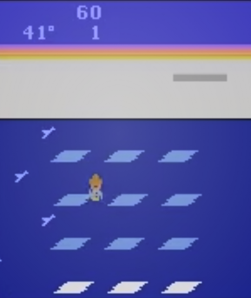

<div style="text-align:center;">
<h1>Frost Bite</h1>

</div>

# Ojectifs

# Environnement

Todo Open-ai gym.

Gnuplot

# Agents

## Sarsa

```console
+-------------------------------------+
+ Agent: Sarsa                        +
+-------------------------------------+
+ epsilon: 0.2
+ alpha: 0.5
+ gamma: 0.99
+-------------------------------------+
+ Episode 1000              score: 150.0
+ Mean of last 50 = 74.2   Highest Score: 230.0
+-------------------------------------+
  250 +-----------------------------------------------------------------------------------------+
      |                                                                                         |
      |                *                                                                        |
      |                *         *                                                              |
      |                **        *                                                              |
  200 |                **        *                                                              |
      |                **        *        *           *               *                         |
      |    *           **       **    *  **     *    **  *   *      * * *                       |
      |   **   *    *  **       **    *  **     *    **  **  *      * * * *       *             |
      |   **   *   **  ****     ** *  ** ***    *    **  **  *   *  * * * *       *  *         *|
  150 |   **** * * *** ****     ** * *** **** * *  * ** *** ** * *  * * * **      *  *    *  * *|
      |* ***** * * ********  *  **** *** **** * *  *********** * *  * ****** *  * *  *    ** * *|
      |* ********* ********  ** **** ********** *  *********** ***  * ****** *  * ** **   ** ***|
      |* ********* ********  ** **** ********** *  *********** ***  * ****** *  * ** **   ** ***|
      |* ********* ******** *** **** ************  *********** ****** ****** *  **** **  *** ***|
      |******************************************* *********** ************* ******* *** *** ***|
  100 |******************************************************* ************* ******* ***********|
      |*****************************************************************************************|
      |*****************************************************************************************|
      |*****************************************************************************************|
      |*****************************************************************************************|
   50 |*************************************************************************** *************|
      |**************************************************************** *** ****** ****** ******|
      |********* ****** *********************** ****************** **** *** ****** ****** ** ***|
      |****** *  *****  * *****   * ***  * **** * * ******** ***** * *  *** ** *** ****** ** ***|
      |** **     * ***  *     *   *  *   * ***  * * **** **   *  * * *      *  *** ** * * **  **|
    0 +-----------------------------------------------------------------------------------------+
      0       100      200      300      400      500      600      700      800      900      100
```

```
+-------------------------------------+
+ Agent: Sarsa                        +
+-------------------------------------+
+ epsilon: 0.4
+ alpha: 0.1
+ gamma: 0.99
+-------------------------------------+
+ Episode 1000              score: 80.0
+ Mean of last 50 = 82.4   Highest Score: 260.0
+-------------------------------------+
  300 +-----------------------------------------------------------------------------------------+
      |                                                                                         |
      |                                                                                         |
      |     *                                                                                   |
  250 |     *                                                                                   |
      |     *                                                                                   |
      |     *                                                                                   |
      |     * *                                                                                 |
      |     * *                                                                                 |
  200 |     * **                                                         *                      |
      |     * **        *    *     * *        *  *         *             *            *   *  *  |
      |   * * **       **    *     * *        *  *       * *      *    * *   *  **  * *   * *** |
      |   * * ** *  *  **    *    ** **  *   **  *      ** *     **   ** *   *  **  * *   * *** |
  150 |   * *********  **   **    ** *** *   *** *** * ***** **  ** * *****  *  ** ** **  * ****|
      |   ****************  **  * ****** *   ******* ******* **  *********** *  ***** **  * ****|
      | * ****************  ** ** ********   ******* ********** ************** *********  * ****|
      |******************* *********************************************************************|
  100 |*****************************************************************************************|
      |*****************************************************************************************|
      |*****************************************************************************************|
      |*****************************************************************************************|
      |*****************************************************************************************|
   50 |*****************************************************************************************|
      |********************************* ******  ********************** ************************|
      |* ****** ** *** ******** * * * *  ******  *    ***** **  ** * *  * **   ****** *  ** *  *|
      |* *** *     * *  ** ***    *   *   ** *   *    * * * **  ** * *  *  *    *****    *  *   |
    0 +-----------------------------------------------------------------------------------------+
      0       100      200      300      400      500      600      700      800      900      1000
    ```

## Reinforce

```console
+-------------------------------------+
+ Agent: Reinforce                    +
+-------------------------------------+
+ learning_rate: 0.001
+ gamma: 0.99
+ hidden1: 36
+ hidden2: 36
+-------------------------------------+
+ Episode 1000              score: 50.0
+ Mean of last 50 = 66.4   Highest Score: 220.0
+-------------------------------------+
  250 +-----------------------------------------------------------------------------------------+
      |                                                                                         |
      |                                                                                         |
      |                                        *                                       *   *    |
      |                                        *                                       *   *    |
  200 |                       *                *   *                                   *   *    |
      |                   *   *                *   *                 *                **   *    |
      |                   * * *        *  *    *   * *               *            *   **  **    |
      |        *          * * *        *  *   **   * *  *          * *            *   **  **    |
      |  * *   *          *** *        *  *   **   * *  *       *  * *       **   *   **  **    |
  150 |  * *   ***  *    **** * *  * * *  *   ***  * * **     * *  * * *    ***   **  **  **  **|
      |  * *   *** ** *  ********* * * ** *** ***  *** **     * *  * * **  ****   *** **  **  **|
      |* * * * ******** ********** * ************* *** *** * ** ** * ***** ****  **** ****** ***|
      |* * * * ******** ********** * ************* *** *** * ** ** * ***** ****  **** ****** ***|
      |*** * ********** ************************** *** ***** ** *************** ************ ***|
      |***** ********** ******************************************************* ****************|
  100 |***** ****************************************************************** ****************|
      |***** ***********************************************************************************|
      |*****************************************************************************************|
      |*****************************************************************************************|
      |*****************************************************************************************|
   50 |********************* ********************************************************** ********|
      |***** *************** ********************************************************** ********|
      |*****  ************** * ****** ************************************* ******* *** ********|
      | ***   **** ********* * ****** ** **  *** *** **** * ******** *** **  ****** * * *** **  |
      | * *   ***     ****       ** *  * **  *** *   * ** *  *  **    ** **   ***** * * *   *   |
    0 +-----------------------------------------------------------------------------------------+
      0       100      200      300      400      500      600      700      800      900      1000
```

```console
+-------------------------------------+
+ Agent: Reinforce                    +
+-------------------------------------+
+ learning_rate: 0.01
+ gamma: 0.9
+ hidden1: 128
+ hidden2: 128
+ hidden3: 128
+-------------------------------------+
+ Episode 1000              score: 40.0
+ Mean of last 50 = 79.0   Highest Score: 220.0
+-------------------------------------+
  250 +-----------------------------------------------------------------------------------------+
      |                                                                                         |
      |                                                                                         |
      |     *                                                                                   |
      |     *                 *                                                                 |
  200 |     *                 *                                                                 |
      |     *   *           * *         *                                    *                  |
      |  * **   *         * * *         *                                    *                  |
      |  * **   *    *    * * *         *            *       * *             *                **|
      | ** **   *    *   ** * *   *     *      *  ** *      ** *          *  ** * * **  *    ***|
  150 | ** **   *    * * ** * *  ** *   *  *   * *** *   *  ** *    *     *  ** * **** **    ***|
      | ** **   *   ** * **** * *** *  *** *   ***** * * ** ** *    *    ** *** * **** **   ****|
      | ** **   * ****** **** ***** *  *** *   ******* * ***** *    *  **** *** * *******  *****|
      |*** ***  * ****** **** ***** *  *** *   ******* * ***** *    *  **** *** * *******  *****|
      |*** ***  ******** **** ***** ********** ******* * *******    * ***** *** ********* ******|
      |*** *** ************** ************************ * ********* ** **************************|
  100 |*** ****************** ************************ * ********* ** **************************|
      |*** ******************************************* * ***************************************|
      |*****************************************************************************************|
      |*****************************************************************************************|
      |*****************************************************************************************|
   50 |*****************************************************************************************|
      |********************************************************************** ******************|
      |********************************************** **** ****************** ******************|
      |** * * * ********** ***** *********** ****  ** * ** **** ** ***** *    ** ** **** *****  |
      |** * * * * *******  *****  ** ***** * ***   *  * *  **   *  ** **      *   *  * *  * **  |
    0 +-----------------------------------------------------------------------------------------+
      0       100      200      300      400      500      600      700      800      900      1000
```

```
+-------------------------------------+
+ Agent: Reinforce                    +
+-------------------------------------+
+ learning_rate: 0.001
+ gamma: 0.5
+ hidden1: 128
+ hidden2: 128
+ hidden2: 18
+-------------------------------------+
+ Episode 7095              score: 30.0
+ Mean of last 50 = 70.8   Highest Score: 260.0
+-------------------------------------+
  300 +-----------------------------------------------------------------------------------------+
      |                                                                                         |
      |                                                                                         |
      |                                  *                                                      |
  250 |                                  *                                                      |
      |               *                  *                                                      |
      |        *      *                  *                                                      |
      |        *      *  *               *         *          *                    *            |
      |   *    *      *  *       *       * *       *       *  ** *                 *            |
  200 |  **  ***     **  *   *   **   *  ***  *   **      **  ** *           *   * *            |
      |* *** *********** *********** **  **** *** ***   **** *** **** * *** ******** *          |
      |********************************  **** ********  **************************** **         |
      |********************************  ******************************************* **         |
  150 |********************************************************************************         |
      |********************************************************************************         |
      |********************************************************************************         |
      |********************************************************************************         |
  100 |********************************************************************************         |
      |********************************************************************************         |
      |********************************************************************************         |
      |********************************************************************************         |
      |********************************************************************************         |
   50 |********************************************************************************         |
      |********************************************************************************         |
      |********************************************************************************         |
      |******** *********************************************** ***********************         |
    0 +-----------------------------------------------------------------------------------------+
      0         1000        2000       3000       4000       5000        6000       7000       8000

```

DQN
```
+-------------------------------------+
+ Agent: DQN                    +
+-------------------------------------+
+ epsilon: 1
+ facteur decroissange: .9995
+ obs_size: 128
+-------------------------------------+
+ Episode 2178              score: 20.0
+ Mean of last 50 = 124.0   Highest Score: 250.0
+-------------------------------------+
  250 +-----------------------------------------------------------------------------------------+
      |               *                                                            *            |
      |               *              *                                             **           |
      |               *              *           *                                 **           |
      |               *              *           **                          *     **           |
  200 |               *     *  ***   * *   *  *  ** *                  *  *  *  *  **           |
      |             * *     *  ***** * *   *  *  ** *           *      *  * *****  **           |
      |   *         * *   * ** *********   *  * *** *          ** *    *  * ***** ***           |
      | * *  * *  * * *   * ** *********   *  * *** *         *****    * ******** ***           |
      | ***  * *  * ***  ** *************  ** * *** *   *     *****   ** ******** ***           |
  150 | **** * *  *****  ****************  ** * *** *  **     ******* ** ************           |
      | ****** *  ************************ ** * *****  **    ******** ***************           |
      |******* * ************************* ** * ***** ***    ******** ***************           |
      |******* * ************************* ** * ***** ***    ******** ***************           |
      |******* ****************************** * ***** *** *  ************************           |
      |************************************** * ********* *  ************************           |
  100 |**************************************** ***********  ************************           |
      |**************************************** *********** *************************           |
      |******************************************************************************           |
      |******************************************************************************           |
      |******************************************************************************           |
   50 |******************************************************************************           |
      |******************************************************************************           |
      |******************************************************************** * *******           |
      |********** ******** ***********************************************    *******           |
      |*********  ******** ************************************ **** ***       **** *           |
    0 +-----------------------------------------------------------------------------------------+
      0                500               1000              1500              2000              2500
```

```
+-------------------------------------+
+ Agent: DQN                    +
+-------------------------------------+
+ epsilon: 0.01
+ obs_size: 128
+-------------------------------------+
+ Episode 2553              score: 210.0
+ Mean of last 50 = 176.6   Highest Score: 1470.0
+-------------------------------------+
  1600 +----------------------------------------------------------------------------------------+
       |                                                                                        |
       |                                                                        *               |
  1400 |                                                                        *               |
       |                                                                        *               |
       |                                                                        *               |
  1200 |                                                                        *               |
       |                                                                        *               |
       |                                                                        *               |
       |                                                                        *               |
  1000 |                                                                        *               |
       |                                                                        *               |
       |                                                                        *               |
   800 |                                                                        *               |
       |                                                                        *               |
       |                                                                        *               |
   600 |                                                                        *               |
       |                                                                        *               |
       |                                                                        *               |
   400 |                                                                        *               |
       |                                                                        *               |
       |                                                                        *               |
       |                                            * *            **** ***********             |
   200 |**** * *                    *  *   * ********** ****************************            |
       |************** * * ***   **************************************************             |
       |***************************************************************************             |
     0 +----------------------------------------------------------------------------------------+
       0             500            1000           1500          2000           2500           3000
```

Suite a un crash de la machine sur GCP je n'ai pas pu garder une trace du dernier graphique. La derniere fois que j'avais regarder le graphique on voyait le modele qui avait reussi a faire plusieurs parties superieure a 1400 points.

Cependant l'enregistrement des poids du model en `fichier.h5` etait activer alors j'ai pu conserver l'entrainement qu'il avait realiser jusqu'a un certain point problablement proche du crash.

J'ai ajuster le code pour repartir des poids sauvegardes. Seul difference, j'ai enlever l'exploration et la decroissance pour qu'il reparte de ses acquis. Donc epsilon a 0.01 en partant.

On voit que des les premiers episodes il est capable de refaire une partie superieure a 1400 points, ce qui est encourageant.
```C
+-------------------------------------+
+ Agent: DQN                    +
+-------------------------------------+
+ epsilon: 0.01
+ obs_size: 128
+-------------------------------------+
+ Episode 16              score: 170.0
+ Mean of last 50 = 203.125   Highest Score: 1420.0
+-------------------------------------+
  1600 +----------------------------------------------------------------------------------------+
       |                                                                                        |
       |                                                                                        |
  1400 |                                                                  *                     |
       |                                                                  *                     |
       |                                                                 **                     |
  1200 |                                                                 * *                    |
       |                                                                 * *                    |
       |                                                                 * *                    |
       |                                                                *  *                    |
  1000 |                                                                *   *                   |
       |                                                                *   *                   |
       |                                                               *    *                   |
   800 |                                                               *    *                   |
       |                                                               *     *                  |
       |                                                              *      *                  |
   600 |                                                              *      *                  |
       |                                                              *      *                  |
       |                                                              *      *                  |
   400 |                                                             *        *                 |
       |                                                             *        *                 |
       |                                                             *        *                 |
       |                                                            *         *                 |
   200 |                               *******                    ***          *        ***     |
       |  ********   **************  **       ***********   ******             *  ******        |
       |**        ***              **                    ***                   ***              |
     0 +----------------------------------------------------------------------------------------+
       0          2          4          6           8          10         12         14         16
```

Il reussi a avoir deux autres runs interessantes dans un intervalle de 100 parties. Je m'interesse au run superieur a 300 car en-bas de 300 le bot est encore dans le meme niveau du jeu.

```C
+-------------------------------------+
+ Agent: DQN                    +
+-------------------------------------+
+ epsilon: 0.01
+ obs_size: 128
+-------------------------------------+
+ Episode 137              score: 190.0
+ Mean of last 50 = 121.2   Highest Score: 1420.0
+-------------------------------------+
  1600 +----------------------------------------------------------------------------------------+
       |                                                                                        |
       |                                                                                        |
  1400 |       *                                                                                |
       |       *                                                                                |
       |       *                                                                                |
  1200 |       *                                                                                |
       |       *                                                                                |
       |       *                                                                                |
       |       *                                                                                |
  1000 |       *                                                                                |
       |       *                                                                                |
       |       *                                   *                                    *       |
   800 |       *                                   *                                    *       |
       |      **                                   *                                    *       |
       |      **                                   *                                    *       |
   600 |      **                                   *                                    *       |
       |      **                                   *                                    *       |
       |      **                                   **                                   *       |
   400 |      **                                  * *                                  **       |
       |      **                                  * *                                  **       |
       |      **                                  * *                                  **       |
       |      **    *      *      * *             * *                                  **       |
   200 |   *  ** **** *  * *   * **** *  *  *** *** ***     *   ** * *     *       *  *** * **  |
       |****** ***  *** **** * ** * ****** * ** * * ** *** ** * ** * *    * *  * *** **** ** *  |
       |* *  * *       * *  ***     *    *** ***  *       * **** ** ****  * ******  ***  *      |
     0 +----------------------------------------------------------------------------------------+
       0            20          40           60           80          100         120          140
```

Je vais arreter d'enregistrer le modele a chaque episode pour accelerer le temps d'entraintement, tant pis si des crashs comme la derniere fois arrive, je repartirai un peu en arriere.

```python
# DQN - Replay Method
# ...
if self.episodes_not_saved == 100:
    self.model_network.save_weights("weights2.h5")
    self.episodes_not_saved = 0
    
self.episodes_not_saved += 1
```

Je vais ajouter un 2eme graph pour suivre la tendance de la moyenne pour voir quand est-ce qu'on atteint des minimums locaux pour mieux comprendre et suivre l'apprentissage.